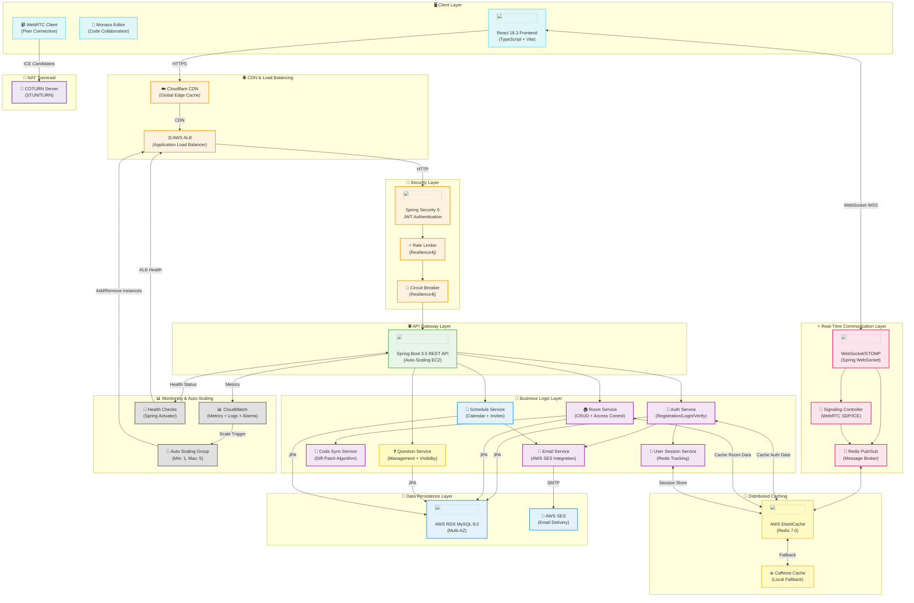
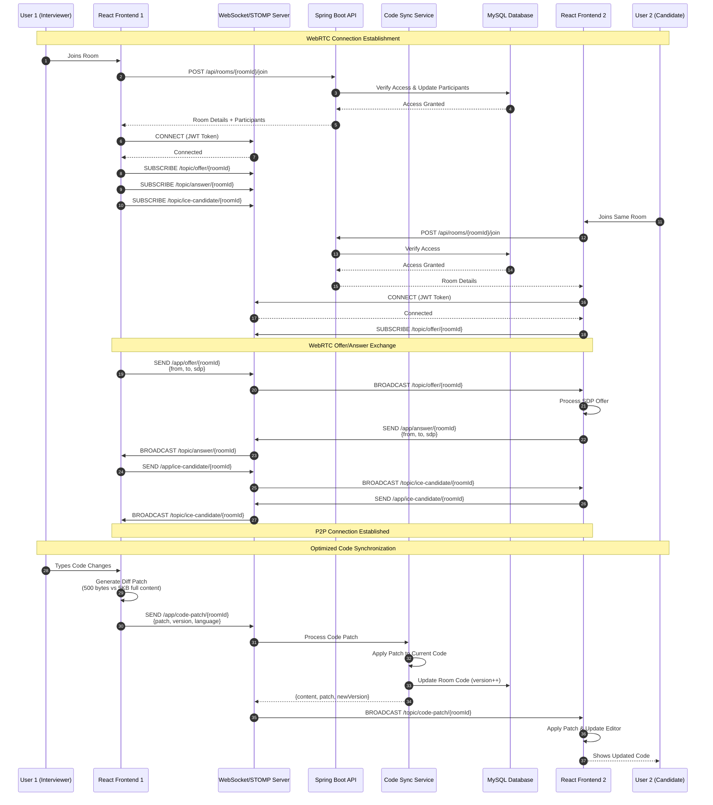

# 🎥 FuseMeet - Enterprise Video Collaboration Platform

[](https://www.oracle.com/java/)
[](https://spring.io/projects/spring-boot)
[](https://www.typescriptlang.org/)
[](https://reactjs.org/)
[](https://webrtc.org/)
[](https://www.mysql.com/)
[](https://redis.io/)
[](https://aws.amazon.com/)

---

## 📋 Table of Contents

- [Overview](#overview)
- [Key Features](#key-features)
- [System Architecture](#system-architecture)
- [Technology Stack](#technology-stack)
- [AWS Cloud Infrastructure](#aws-cloud-infrastructure)
- [Project Structure](#project-structure)
- [API Endpoints](#api-endpoints)
- [WebSocket Communication](#websocket-communication)
- [Database Schema](#database-schema)
- [Setup Instructions](#setup-instructions)
- [Configuration](#configuration)
- [Security Features](#security-features)
- [Deployment Architecture](#deployment-architecture)

---

## 🌟 Overview

**FuseMeet** is a production-grade, cloud-native video collaboration platform built for interviews, online classes, and virtual meetings. Deployed on AWS with enterprise-level scalability, it combines WebRTC for peer-to-peer communication, Redis for distributed caching, and real-time code collaboration with Monaco Editor.

### Core Capabilities
- 🎥 **Real-time Video/Audio** via WebRTC peer-to-peer communication with STUN/TURN support
- 💻 **Live Code Collaboration** with Monaco Editor and diff-patch optimization (90% bandwidth reduction)
- 📝 **Question Management** for structured technical interviews and assessments
- 🔐 **Enterprise Security** with JWT authentication, email verification, and role-based access control
- 🏠 **Multi-Room Support** with interview rooms, classrooms, and scheduled sessions
- 📧 **Email Notifications** via AWS SES for verification, invitations, and alerts
- 🎨 **Digital Whiteboard** for visual collaboration and brainstorming
- � **Smart Scheduling** with timezone-aware calendar and invitations
- ⚡ **Auto-Scaling** on AWS with CloudWatch metrics and Application Load Balancer
- 🚀 **Distributed Architecture** using Redis for session management and WebSocket message brokering

---

## ✨ Key Features

| Feature | Description |
|---------|-------------|
| **WebRTC Video Conferencing** | High-quality P2P video/audio with ICE candidate exchange and COTURN relay servers |
| **Real-time Code Editor** | Monaco-based code editor with 50+ language support and IntelliSense |
| **Optimized Code Synchronization** | Diff-patch algorithm reducing bandwidth by 90% (Java Diff Utils) |
| **Digital Whiteboard** | Collaborative canvas with drawing tools, shapes, and real-time sync |
| **Question Bank Management** | CRUD operations with visibility controls and category organization |
| **Multi-Room Support** | Interview rooms, classrooms (up to 100 participants), and flexible scheduling |
| **Smart Scheduling** | Timezone-aware scheduling with Google Calendar-style invitations |
| **Room Invitations** | Email-based invitations with RSVP tracking (Accept/Decline/Maybe) |
| **Class Groups** | Manage student/teacher groups with bulk invitation support |
| **Rate Limiting** | Resilience4j-based rate limiting (1000 req/sec) to prevent abuse |
| **Email Verification** | AWS SES-powered email verification with time-limited tokens |
| **Session Management** | Redis-backed distributed sessions across multiple backend instances |
| **Distributed Caching** | AWS ElastiCache (Redis) with Caffeine fallback for local dev |
| **WebSocket Security** | JWT-based authentication with STOMP protocol and channel authorization |
| **Health Monitoring** | Spring Actuator endpoints for ALB health checks and metrics |
| **Auto-Scaling** | CloudWatch custom metrics triggering EC2 Auto Scaling policies |
| **Circuit Breaker** | Resilience4j circuit breaker preventing cascade failures |
| **HTTPS/SSL** | Let's Encrypt SSL certificates with Cloudflare CDN integration |

---

## 🏗️ System Architecture

Our cloud-native architecture leverages AWS services for scalability, reliability, and global reach. The system employs a microservices-oriented approach with clear separation between presentation, API gateway, real-time communication, caching, and data persistence layers.



---

## 🔄 WebRTC Signaling & Code Synchronization Flow



---

## 🛠 Technology Stack

### Backend Technologies

#### Core Framework
- **Spring Boot 3.5.7** - Enterprise-grade application framework
  - `spring-boot-starter-web` - RESTful API with embedded Tomcat (512 threads max)
  - `spring-boot-starter-data-jpa` - ORM with Hibernate 6
  - `spring-boot-starter-security` - Comprehensive security framework
  - `spring-boot-starter-websocket` - WebSocket support (STOMP protocol)
  - `spring-boot-starter-validation` - Bean Validation (JSR-380)
  - `spring-boot-starter-mail` - Email functionality (SMTP)
  - `spring-boot-starter-cache` - Caching abstraction
  - `spring-boot-starter-actuator` - Monitoring and health checks
  - `spring-boot-starter-amqp` - RabbitMQ message broker (optional)
  - `spring-boot-starter-data-redis` - Redis integration

#### Security Stack
- **Spring Security 6** - Authentication and authorization
- **JWT (JJWT 0.12.3)** - Stateless token-based authentication
  - Access tokens (24h expiration)
  - Refresh tokens (7 days expiration)
  - HttpOnly cookies for web security
- **BCrypt** - Password hashing (10 rounds, salt-based)
- **Spring Security Messaging** - WebSocket channel authorization

#### Database & ORM
- **MySQL 8.0+** - Relational database (AWS RDS Multi-AZ)
- **Spring Data JPA** - Repository pattern with Hibernate 6
- **HikariCP** - High-performance connection pooling (200 max connections)
- **Hibernate 2nd Level Cache** - JCache with Redis integration

#### Real-Time Communication
- **Spring WebSocket** - WebSocket protocol support
- **STOMP** - Simple Text Oriented Messaging Protocol
- **SockJS 1.5.1** - WebSocket fallback mechanism
- **Spring Integration** - Message routing and transformation
  - `spring-integration-stomp` - STOMP integration
  - `spring-integration-redis` - Redis pub/sub for horizontal scaling
  - `spring-integration-websocket` - WebSocket handlers

#### Distributed Caching & Session Management
- **Redis 7.0** - In-memory data structure store
  - Session storage (`spring-session-data-redis`)
  - Distributed caching layer
  - WebSocket message broker (pub/sub)
  - User session tracking
- **Lettuce** - Redis client (async, thread-safe)
- **Caffeine Cache** - High-performance local cache fallback
- **Spring Cache Abstraction** - Declarative caching with `@Cacheable`

#### Resilience & Circuit Breaking
- **Resilience4j 2.2.0** - Fault tolerance library
  - Circuit Breaker (50% failure threshold, 10s wait duration)
  - Rate Limiter (1000 requests/second per service)
  - Bulkhead pattern for resource isolation
- **Spring Retry** - Automatic retry logic

#### Monitoring & Observability
- **Spring Actuator** - Production-ready features
  - Health endpoints (`/actuator/health`, `/actuator/ready`, `/actuator/alive`)
  - Metrics endpoints (`/actuator/metrics`, `/actuator/prometheus`)
  - Database, Redis, and service health checks
- **Micrometer** - Application metrics facade
- **Micrometer CloudWatch2** - AWS CloudWatch integration
  - Custom metrics (active rooms, participants count, processing load)
  - Auto-scaling triggers based on custom metrics
- **Prometheus** - Metrics export format

#### Cloud & AWS Integration
- **AWS SDK for Java 2.x** - AWS service integration
  - `CloudWatchAsyncClient` - Async metrics publishing
  - SES SMTP integration for emails
  - RDS MySQL connection
  - ElastiCache Redis connection

#### Utilities & Libraries
- **Lombok** - Reduces boilerplate code (`@Data`, `@Builder`, `@Slf4j`)
- **ModelMapper 3.2.0** - Object-to-DTO mapping with custom converters
- **Java Diff Utils 4.12** - Unified diff-patch algorithm for code synchronization
- **Jackson** - JSON serialization/deserialization with custom modules
- **Apache Commons** - Utility functions

#### Build & Development
- **Maven 3.9+** - Dependency management and build lifecycle
- **Java 21** - LTS version with virtual threads, pattern matching, records
- **Maven Wrapper** - Ensures consistent Maven version across environments

---

### Frontend Technologies

#### Core Stack
- **React 18.3.1** - Component-based UI library with Concurrent Features
- **TypeScript 5.8.3** - Type-safe development with strict mode
- **Vite 5.4.19** - Lightning-fast build tool with HMR (Hot Module Replacement)
- **React Router Dom** - Client-side routing

#### State Management & Data Fetching
- **TanStack React Query 5.83.0** - Server state management with caching
- **Axios 1.6.2** - Promise-based HTTP client with interceptors
- **React Context API** - Global state management (Auth, Room contexts)

#### UI Framework & Components
- **Radix UI** - Accessible, unstyled component primitives
  - `@radix-ui/react-dialog` - Modal dialogs
  - `@radix-ui/react-dropdown-menu` - Dropdown menus
  - `@radix-ui/react-tabs` - Tab navigation
  - `@radix-ui/react-tooltip` - Tooltips
  - `@radix-ui/react-switch` - Toggle switches
  - 20+ other primitives
- **Tailwind CSS 3.4.17** - Utility-first CSS framework
- **shadcn/ui** - Re-usable component collection built on Radix
- **Lucide React** - Beautiful, consistent icon library (1000+ icons)
- **Framer Motion** - Production-ready animation library
- **class-variance-authority** - CSS variant utility
- **clsx** - Class name composition

#### Code Editor
- **Monaco Editor 4.6.0** - VS Code's editor engine
  - Syntax highlighting for 50+ languages
  - IntelliSense and code completion
  - Diff viewer for code comparison
  - Custom themes and language support

#### Real-Time Communication & WebRTC
- **@stomp/stompjs 7.0.0** - STOMP protocol over WebSocket
- **SockJS Client 1.6.1** - WebSocket fallback for older browsers
- **Simple-peer** - WebRTC wrapper for P2P connections
- **Diff 5.2.0** - Diff algorithm for code synchronization

#### Form Management & Validation
- **React Hook Form 7.61.1** - Performant, flexible forms
- **Zod 3.25.76** - TypeScript-first schema validation
- **@hookform/resolvers** - Validation resolver for React Hook Form

#### Additional Libraries
- **date-fns 3.6.0** - Modern date utility library
- **embla-carousel-react 8.6.0** - Lightweight carousel
- **recharts** - Composable charting library
- **sonner** - Toast notifications
- **canvas-confetti** - Celebration effects

---

## ☁️ AWS Cloud Infrastructure

FuseMeet is deployed on AWS with a highly available, scalable, and secure infrastructure. The platform leverages multiple AWS services for compute, storage, caching, messaging, monitoring, and email delivery.

### 🖥️ Compute & Auto-Scaling

#### **EC2 Auto Scaling Group**
- **Service**: Amazon EC2 (Elastic Compute Cloud)
- **Purpose**: Horizontal scaling of Spring Boot backend instances
- **Configuration**:
  - **Instance Type**: t2.medium (2 vCPU, 4 GB RAM)
  - **Min Instances**: 1
  - **Desired Instances**: 2
  - **Max Instances**: 5
  - **AMI**: Amazon Linux 2023
  - **Java Runtime**: OpenJDK 21
- **Auto-Scaling Policies**:
  - **Scale-Up Trigger**: CPUUtilization > 70% for 2 consecutive periods (2 minutes)
  - **Scale-Down Trigger**: CPUUtilization < 30% for 5 consecutive periods (5 minutes)
  - **Custom Metrics**:
    - `webrtc.rooms.active.count` > 50 triggers scale-up
    - `webrtc.participants.total.count` > 200 triggers scale-up
    - `webrtc.processing.load` > 80% triggers scale-up
- **Health Checks**:
  - **ALB Health Check**: `/actuator/health` endpoint (30s interval)
  - **EC2 Status Check**: System reachability (60s interval)
- **Launch Template**:
  - Security groups for HTTP (8080), SSH (22), and HTTPS (443)
  - User data script for automated deployment
  - IAM role with CloudWatch and RDS permissions

#### **Application Load Balancer (ALB)**
- **Service**: AWS Elastic Load Balancing
- **Purpose**: Distribute traffic across multiple backend instances
- **Configuration**:
  - **Type**: Application Load Balancer (Layer 7)
  - **Scheme**: Internet-facing
  - **Availability Zones**: ap-south-1a, ap-south-1b (Multi-AZ)
  - **Protocol**: HTTP/HTTPS
  - **Port**: 8080 (HTTP), 443 (HTTPS)
- **Target Group**:
  - **Health Check Path**: `/actuator/health`
  - **Health Check Interval**: 30 seconds
  - **Healthy Threshold**: 2 consecutive successes
  - **Unhealthy Threshold**: 2 consecutive failures
  - **Timeout**: 5 seconds
  - **Deregistration Delay**: 30 seconds
- **Sticky Sessions**: Enabled (1 hour duration) for WebSocket affinity
- **Connection Draining**: 30 seconds

---

### 🗄️ Database & Storage

#### **Amazon RDS for MySQL**
- **Service**: Amazon RDS (Relational Database Service)
- **Purpose**: Primary database for user data, rooms, questions, schedules
- **Configuration**:
  - **Engine**: MySQL 8.0.35
  - **Instance Class**: db.t3.medium (2 vCPU, 4 GB RAM)
  - **Storage**: 100 GB General Purpose SSD (gp3)
  - **Multi-AZ**: Enabled (synchronous replication to standby)
  - **Automatic Backups**: Enabled (7-day retention)
  - **Backup Window**: 03:00-04:00 UTC
  - **Maintenance Window**: Sunday 04:00-05:00 UTC
- **Performance**:
  - **Max Connections**: 200 (HikariCP pool size)
  - **Connection Timeout**: 30 seconds
  - **IOPS**: 3000 baseline
- **Security**:
  - **Encryption at Rest**: AES-256 (AWS KMS)
  - **Encryption in Transit**: TLS 1.2
  - **Security Group**: Private subnet, only accessible from backend EC2 instances
  - **Parameter Group**: Custom group with optimized settings
    - `max_connections=500`
    - `innodb_buffer_pool_size=2GB`
    - `query_cache_size=0` (disabled in MySQL 8.0)
- **Monitoring**:
  - Enhanced monitoring enabled (60-second granularity)
  - CloudWatch alarms for CPU, memory, storage, and connections

---

### ⚡ Caching & Session Management

#### **Amazon ElastiCache for Redis**
- **Service**: AWS ElastiCache
- **Purpose**: Distributed caching, session store, and WebSocket message broker
- **Configuration**:
  - **Engine**: Redis 7.0
  - **Node Type**: cache.t3.medium (2 vCPU, 3.09 GB RAM)
  - **Cluster Mode**: Disabled (single shard)
  - **Replicas**: 1 read replica
  - **Multi-AZ**: Enabled (automatic failover)
  - **Endpoint**: `master.ziyadwebrtc-redis.lkoqab.aps1.cache.amazonaws.com:6379`
- **Connection Pool**:
  - **Max Active Connections**: 300
  - **Max Idle**: 120
  - **Min Idle**: 25
  - **Max Wait**: 5000ms
- **Use Cases**:
  - **Session Storage**: Spring Session with Redis
    - Namespace: `spring:session`
    - TTL: 30 minutes
  - **Distributed Cache**: User profiles, room data, questions
    - Default TTL: 1 hour
    - Custom TTLs for specific caches
  - **WebSocket Pub/Sub**: Broadcasting messages across backend instances
    - Channels: `/topic/offer`, `/topic/answer`, `/topic/ice-candidate`, `/topic/code-patch`
  - **User Session Tracking**: Active users, presence status
    - Key pattern: `user:session:{userId}`
- **Security**:
  - **Encryption in Transit**: TLS enabled
  - **Encryption at Rest**: Enabled
  - **Security Group**: Private subnet, accessible only from backend instances
  - **Auth Token**: Disabled (using security groups)
- **Monitoring**:
  - CloudWatch metrics: CPU, memory, network, cache hits/misses
  - Automatic failover to replica on primary failure (< 60 seconds)

---

### 📧 Email Service

#### **Amazon SES (Simple Email Service)**
- **Service**: AWS SES
- **Purpose**: Transactional emails (verification, invitations, password reset)
- **Configuration**:
  - **Region**: ap-south-1 (Mumbai)
  - **SMTP Endpoint**: `email-smtp.ap-south-1.amazonaws.com:587`
  - **Protocol**: STARTTLS
  - **From Email**: `noreply@fusemeet.live`
  - **Domain**: fusemeet.live (verified domain)
- **Email Types**:
  - **Email Verification**: Token-based verification (24h expiration)
  - **Room Invitations**: RSVP tracking (Accept/Decline/Maybe)
  - **Password Reset**: Secure token links (1h expiration)
  - **Schedule Reminders**: Automated calendar notifications
- **Limits**:
  - **Sending Quota**: 50,000 emails/day
  - **Sending Rate**: 14 emails/second
- **Security**:
  - **DKIM**: Enabled for email authentication
  - **SPF**: Configured for sender verification
  - **DMARC**: Policy set to `quarantine`
- **Monitoring**:
  - Bounce and complaint rates tracked in CloudWatch
  - SNS notifications for reputation metrics

---

### 📊 Monitoring & Observability

#### **Amazon CloudWatch**
- **Service**: AWS CloudWatch
- **Purpose**: Centralized monitoring, logging, and alerting
- **Metrics Collection**:
  - **System Metrics**: CPU, memory, disk, network (EC2, RDS, ElastiCache)
  - **Application Metrics**: Custom metrics via Micrometer
    - `webrtc.rooms.active.count` - Active interview/classroom rooms
    - `webrtc.participants.total.count` - Total participants across all rooms
    - `webrtc.processing.load` - Calculated processing load (0-100%)
  - **Publishing Frequency**: Every 60 seconds
  - **Batch Size**: 20 metrics per batch
- **Logs**:
  - **Log Group**: `/aws/ec2/ZiyadWebRTC`
  - **Retention**: 7 days
  - **Logs**: Application logs, access logs, error logs
- **Alarms**:
  - **High CPU**: CPU > 80% for 5 minutes → SNS notification
  - **High Memory**: Memory > 85% for 5 minutes → SNS notification
  - **Database Connections**: RDS connections > 180 → SNS notification
  - **Redis Memory**: ElastiCache memory > 90% → SNS notification
  - **ALB 5xx Errors**: 5xx errors > 10 in 5 minutes → SNS notification
- **Dashboards**:
  - Real-time dashboard for system health
  - Custom widgets for application metrics

#### **Spring Actuator Health Endpoints**
- **Purpose**: Application health monitoring for ALB and operations
- **Endpoints**:
  - `/actuator/health` - Comprehensive health check (ALB target)
    - Database connectivity (MySQL)
    - Redis connectivity
    - Disk space
    - Overall status: UP/DOWN
  - `/actuator/ready` - Readiness probe (Kubernetes/ECS compatible)
  - `/actuator/alive` - Liveness probe (always UP if app is running)
  - `/actuator/metrics` - Prometheus-format metrics
  - `/actuator/prometheus` - Prometheus scraping endpoint
- **Health Checks**:
  - Database: Connection pool test query
  - Redis: PING command
  - Response Time: < 1 second

---

### 🔀 WebRTC TURN/STUN Servers

#### **COTURN Server**
- **Service**: Self-hosted COTURN on AWS EC2
- **Purpose**: NAT traversal for WebRTC connections
- **Configuration**:
  - **Instance**: t2.micro (1 vCPU, 1 GB RAM)
  - **Ports**:
    - **STUN**: 3478 (UDP/TCP)
    - **TURN**: 3478 (UDP/TCP)
    - **TURN TLS**: 5349 (TCP)
    - **Relay Ports**: 49152-65535 (UDP)
  - **Realm**: fusemeet.live
  - **Authentication**: Time-limited credentials
- **Usage**:
  - **STUN**: Discover public IP behind NAT
  - **TURN**: Relay media when P2P fails (corporate firewalls)
  - **Fallback**: Only used when direct P2P fails (< 10% of connections)
- **Security**:
  - **TLS**: Let's Encrypt SSL certificate
  - **Credentials**: Dynamic, short-lived (1 hour TTL)
  - **Security Group**: Restricted UDP/TCP ports

---

### 🌐 Content Delivery & DNS

#### **Cloudflare CDN**
- **Service**: Cloudflare (3rd-party CDN)
- **Purpose**: Global content delivery, DDoS protection, SSL termination
- **Configuration**:
  - **Domain**: fusemeet.live
  - **DNS**: Cloudflare nameservers
  - **SSL/TLS**: Full (strict) mode
  - **Certificate**: Let's Encrypt (auto-renewed)
- **Features**:
  - **Global Edge Network**: 300+ data centers
  - **DDoS Protection**: Layer 3/4/7 protection
  - **Web Application Firewall (WAF)**: OWASP ruleset
  - **Caching**: Static assets cached globally
  - **Compression**: Brotli and Gzip
- **Performance**:
  - **Frontend**: React build served via Cloudflare Pages or EC2 + Nginx
  - **API**: Proxied through Cloudflare to ALB
  - **WebSocket**: WebSocket support enabled

#### **Amazon Route 53** (Optional)
- **Service**: AWS Route 53
- **Purpose**: DNS management (if not using Cloudflare)
- **Configuration**:
  - **Hosted Zone**: fusemeet.live
  - **Record Types**:
    - A record: fusemeet.live → ALB IP
    - CNAME: www.fusemeet.live → fusemeet.live
    - MX: Email routing for SES

---

### 🔐 Security & Access Management

#### **IAM (Identity and Access Management)**
- **EC2 Instance Role**: Permissions for CloudWatch, RDS, ElastiCache
  - `CloudWatchFullAccess` - Publish custom metrics
  - `AmazonRDSReadOnlyAccess` - Read RDS metadata
  - `AmazonElastiCacheReadOnlyAccess` - Read ElastiCache metadata
- **SES SMTP Credentials**: IAM user with SES send permissions
- **S3 Bucket Policy**: (If using S3 for static assets) Public read access

#### **Security Groups**
- **ALB Security Group**:
  - Inbound: 80 (HTTP), 443 (HTTPS) from 0.0.0.0/0
  - Outbound: 8080 to backend EC2 instances
- **Backend EC2 Security Group**:
  - Inbound: 8080 from ALB, 22 (SSH) from admin IP
  - Outbound: 3306 (MySQL), 6379 (Redis), 443 (HTTPS for external APIs)
- **RDS Security Group**:
  - Inbound: 3306 from backend EC2 security group only
  - Outbound: None (no outbound connections)
- **ElastiCache Security Group**:
  - Inbound: 6379 from backend EC2 security group only
  - Outbound: None
- **COTURN Security Group**:
  - Inbound: 3478 (UDP/TCP), 5349 (TCP), 49152-65535 (UDP) from 0.0.0.0/0
  - Outbound: All traffic

#### **VPC (Virtual Private Cloud)**
- **Network**: Custom VPC in ap-south-1 region
- **Subnets**:
  - **Public Subnets**: ALB, NAT Gateway (2 AZs)
  - **Private Subnets**: Backend EC2, RDS, ElastiCache (2 AZs)
- **Internet Gateway**: Attached for public subnet internet access
- **NAT Gateway**: For private subnet outbound internet access (software updates, external APIs)

---

### 🚀 Deployment & CI/CD

#### **Deployment Scripts**
- **deploy_full_stack.py**: Python script for automated full-stack deployment
  - Creates VPC, subnets, security groups
  - Launches RDS MySQL instance
  - Creates ElastiCache Redis cluster
  - Sets up Auto Scaling Group with Launch Template
  - Configures Application Load Balancer
  - Deploys COTURN server
  - Uploads backend JAR and frontend build
- **setup_backend_autoscaling.py**: Configures auto-scaling policies and CloudWatch alarms
- **setup_aws_ses.py**: Verifies domain and configures SES for email sending
- **setup_turn_instance.py**: Deploys and configures COTURN server

#### **Deployment Process**
1. **Build**: Maven builds Spring Boot JAR, Vite builds React app
2. **Upload**: JAR uploaded to EC2, React build to S3/EC2
3. **Configure**: Environment-specific `application.properties` applied
4. **Launch**: Systemd service starts Spring Boot application
5. **Health Check**: ALB verifies `/actuator/health` before routing traffic
6. **Auto-Scale**: CloudWatch monitors metrics and triggers scaling

---

### 💰 AWS Cost Breakdown (Estimated)

| Service | Configuration | Monthly Cost (USD) |
|---------|--------------|-------------------|
| **EC2 Instances** | 2x t2.medium (24/7) | ~$60 |
| **Application Load Balancer** | 730 hours + data transfer | ~$22 |
| **RDS MySQL** | db.t3.medium Multi-AZ | ~$120 |
| **ElastiCache Redis** | cache.t3.medium + replica | ~$80 |
| **SES** | 50,000 emails/month | ~$5 |
| **CloudWatch** | Metrics, logs, alarms | ~$10 |
| **COTURN Server** | t2.micro | ~$8 |
| **Data Transfer** | Outbound data | ~$15 |
| **Route 53** | Hosted zone + queries | ~$1 |
| **Total** | | **~$321/month** |

> **Note**: Costs vary based on usage. Enabling On-Demand instances or Spot Instances can reduce costs by 50-90%.

---

## 📁 Project Structure

### Backend Structure

```
ZiyadWebRTC/
├── src/
│   ├── main/
│   │   ├── java/ziyad/ziyadwebrtc/
│   │   │   ├── config/                           # Configuration Classes
│   │   │   │   ├── SecurityConfig.java           # Spring Security + JWT config
│   │   │   │   ├── WebSocketConfig.java          # WebSocket/STOMP config
│   │   │   │   ├── RedisConfig.java              # Redis cache + session config
│   │   │   │   ├── RedisWebSocketConfig.java     # Redis message broker for WebSocket
│   │   │   │   ├── CloudWatchMetricsConfig.java  # CloudWatch metrics publishing
│   │   │   │   ├── JwtProperties.java            # JWT configuration properties
│   │   │   │   ├── ApplicationProperties.java    # Custom app properties
│   │   │   │   ├── AsyncConfig.java              # Async executor configuration
│   │   │   │   ├── SessionConfig.java            # Session management config
│   │   │   │   ├── MetricsConfig.java            # Micrometer metrics config
│   │   │   │   └── ModelMapperConfig.java        # DTO mapping configuration
│   │   │   │
│   │   │   ├── controller/                       # REST Controllers
│   │   │   │   ├── AuthController.java           # /api/auth/** endpoints
│   │   │   │   ├── RoomController.java           # /api/rooms/** endpoints
│   │   │   │   ├── QuestionController.java       # /api/rooms/{id}/questions/**
│   │   │   │   ├── ScheduleController.java       # /api/schedules/** endpoints
│   │   │   │   ├── IceServerController.java      # /api/ice-servers (TURN/STUN)
│   │   │   │   ├── HealthController.java         # /actuator/** health checks
│   │   │   │   └── SignalingController.java      # @MessageMapping WebSocket handlers
│   │   │   │
│   │   │   ├── dto/                              # Data Transfer Objects
│   │   │   │   ├── ApiResponse.java              # Standard response wrapper
│   │   │   │   ├── AuthResponse.java             # Login/Register response
│   │   │   │   ├── LoginRequest.java             # Login credentials
│   │   │   │   ├── RegisterRequest.java          # Registration data
│   │   │   │   ├── CreateRoomRequest.java        # Room creation payload
│   │   │   │   ├── JoinRoomRequest.java          # Join room payload
│   │   │   │   ├── RoomResponse.java             # Room details response
│   │   │   │   ├── QuestionRequest.java          # Question CRUD payload
│   │   │   │   ├── QuestionResponse.java         # Question response DTO
│   │   │   │   ├── CreateScheduleRequest.java    # Schedule creation payload
│   │   │   │   ├── ScheduleResponse.java         # Schedule response DTO
│   │   │   │   ├── InviteResponse.java           # Room invitation response
│   │   │   │   ├── ShareRoomRequest.java         # Room sharing payload
│   │   │   │   ├── ShareRoomResponse.java        # Share link response
│   │   │   │   ├── UpdateProfileRequest.java     # User profile update
│   │   │   │   ├── UserProfileResponse.java      # User profile response
│   │   │   │   └── EmailChangeRequest.java       # Email change request
│   │   │   │
│   │   │   ├── entity/                           # JPA Entities
│   │   │   │   ├── User.java                     # User entity + roles
│   │   │   │   ├── Role.java                     # Role (ROLE_USER, ROLE_ADMIN)
│   │   │   │   ├── InterviewRoomEntity.java      # Room entity (interview/classroom)
│   │   │   │   ├── RoomParticipant.java          # Active participants tracking
│   │   │   │   ├── RoomAccess.java               # ACL for room access
│   │   │   │   ├── RoomInvite.java               # Email invitations + RSVP
│   │   │   │   ├── RoomSchedule.java             # Scheduled sessions
│   │   │   │   ├── Question.java                 # Interview questions
│   │   │   │   ├── ClassGroup.java               # Student/teacher groups
│   │   │   │   ├── ClassGroupMember.java         # Group membership
│   │   │   │   └── WhiteboardState.java          # Whiteboard canvas state
│   │   │   │
│   │   │   ├── repository/                       # Spring Data JPA Repositories
│   │   │   │   ├── UserRepository.java           # User CRUD + queries
│   │   │   │   ├── RoleRepository.java           # Role queries
│   │   │   │   ├── InterviewRoomRepository.java  # Room CRUD + queries
│   │   │   │   ├── RoomParticipantRepository.java # Participant tracking
│   │   │   │   ├── RoomAccessRepository.java     # Access control queries
│   │   │   │   ├── RoomInviteRepository.java     # Invitation management
│   │   │   │   ├── RoomScheduleRepository.java   # Schedule queries
│   │   │   │   ├── QuestionRepository.java       # Question CRUD + visibility
│   │   │   │   ├── ClassGroupRepository.java     # Group management
│   │   │   │   ├── ClassGroupMemberRepository.java # Member queries
│   │   │   │   └── WhiteboardStateRepository.java # Whiteboard persistence
│   │   │   │
│   │   │   ├── service/                          # Business Logic Layer
│   │   │   │   ├── AuthService.java              # Registration, login, JWT, verification
│   │   │   │   ├── RoomService.java              # Room CRUD, access control, participant mgmt
│   │   │   │   ├── QuestionService.java          # Question CRUD, visibility control
│   │   │   │   ├── ScheduleService.java          # Schedule creation, invitation management
│   │   │   │   ├── CodeSyncService.java          # Full code synchronization (legacy)
│   │   │   │   ├── CodeSyncServiceOptimized.java # Diff-patch algorithm (90% bandwidth reduction)
│   │   │   │   ├── EmailService.java             # AWS SES email sending + templates
│   │   │   │   ├── UserSessionService.java       # Redis-backed session tracking
│   │   │   │   ├── CustomMetricsService.java     # CloudWatch custom metrics publishing
│   │   │   │   ├── WhiteboardService.java        # Whiteboard canvas state + persistence
│   │   │   │   ├── ClassroomPermissionService.java # Media permissions (classroom mode)
│   │   │   │   ├── AsyncMessagingService.java    # Redis pub/sub message broadcasting
│   │   │   │   └── RateLimitService.java         # Rate limiting (typing, cursor, signaling)
│   │   │   │
│   │   │   ├── security/                         # Security Components
│   │   │   │   ├── JwtTokenProvider.java         # JWT creation/validation
│   │   │   │   ├── JwtAuthenticationFilter.java  # JWT filter chain
│   │   │   │   └── CustomUserDetailsService.java # UserDetailsService impl
│   │   │   │
│   │   │   ├── model/                            # WebSocket Message Models
│   │   │   │   ├── WebRTCMessage.java            # SDP offer/answer/ICE
│   │   │   │   ├── CodePatchMessage.java         # Code diff patches
│   │   │   │   ├── PresenceMessage.java          # User online/offline status
│   │   │   │   ├── WhiteboardMessage.java        # Whiteboard drawing events
│   │   │   │   ├── AccountType.java              # INTERVIEWER, CANDIDATE enums
│   │   │   │   └── RoomType.java                 # INTERVIEW, CLASSROOM enums
│   │   │   │
│   │   │   ├── exception/                        # Exception Handling
│   │   │   │   ├── GlobalExceptionHandler.java   # @RestControllerAdvice
│   │   │   │   ├── ResourceNotFoundException.java
│   │   │   │   ├── UnauthorizedException.java
│   │   │   │   └── RateLimitExceededException.java
│   │   │   │
│   │   │   ├── util/                             # Utility Classes
│   │   │   │   ├── DiffPatchUtil.java            # Code diff/patch utilities
│   │   │   │   └── TokenGenerator.java           # Secure token generation
│   │   │   │
│   │   │   └── ZiyadWebRtcApplication.java       # Spring Boot main class
│   │   │
│   │   └── resources/
│   │       ├── application.properties            # Base configuration
│   │       ├── application-dev.properties        # Development profile
│   │       ├── application-prod.properties       # Production profile
│   │       ├── META-INF/
│   │       │   ├── additional-spring-configuration-metadata.json
│   │       │   └── spring-configuration-metadata.json
│   │       ├── static/                           # Static resources
│   │       │   └── fuse-icon-email.png           # Email logo
│   │       └── templates/                        # Email templates (if using Thymeleaf)
│   │
│   └── test/                                     # Unit & Integration Tests
│       └── java/ziyad/ziyadwebrtc/
│           ├── controller/                       # Controller tests
│           ├── service/                          # Service layer tests
│           └── integration/                      # Integration tests
│
├── deployment_artifacts/                         # AWS Deployment Files
│   ├── application.properties                    # Production config
│   ├── backend-user-data.sh                      # EC2 launch script
│   └── backend_autoscaling_config.json           # Auto-scaling configuration
│
├── deploy_full_stack.py                          # Full AWS deployment script
├── setup_backend_autoscaling.py                  # Auto-scaling setup
├── setup_aws_ses.py                              # SES email configuration
├── setup_turn_instance.py                        # COTURN server deployment
├── cleanup_aws.py                                # Resource cleanup script
├── pom.xml                                       # Maven dependencies
├── mvnw                                          # Maven wrapper (Unix)
├── mvnw.cmd                                      # Maven wrapper (Windows)
└── README.md
```

### Frontend Structure

```
ziyadwebrtc-frontend2/
├── src/
│   ├── components/                               # React Components
│   │   ├── navigation/                           # Navigation components
│   │   │   └── Navbar.tsx
│   │   ├── room/                                 # Room-specific components
│   │   │   ├── ChatPanel.tsx                     # Real-time chat
│   │   │   ├── CodeEditor.tsx                    # Monaco code editor wrapper
│   │   │   ├── ControlBar.tsx                    # Media controls (mic, camera, screen)
│   │   │   ├── ParticipantsList.tsx              # Active participants
│   │   │   ├── QuestionPanel.tsx                 # Question management UI
│   │   │   ├── VideoGrid.tsx                     # Video layout (grid/spotlight)
│   │   │   ├── VideoPanel.tsx                    # Individual video tile
│   │   │   └── Whiteboard.tsx                    # Collaborative whiteboard
│   │   └── ui/                                   # Radix UI components (40+ components)
│   │       ├── accordion.tsx
│   │       ├── alert-dialog.tsx
│   │       ├── button.tsx
│   │       ├── card.tsx
│   │       ├── dialog.tsx
│   │       ├── dropdown-menu.tsx
│   │       ├── form.tsx
│   │       ├── input.tsx
│   │       ├── select.tsx
│   │       ├── tabs.tsx
│   │       ├── toast.tsx
│   │       ├── toaster.tsx
│   │       └── ...35+ more components
│   │
│   ├── pages/                                    # Page components
│   │   ├── Index.tsx                             # Landing page
│   │   ├── Login.tsx                             # Login page
│   │   ├── Register.tsx                          # Registration page
│   │   ├── VerifyEmail.tsx                       # Email verification
│   │   ├── ForgotPassword.tsx                    # Password reset request
│   │   ├── ResetPassword.tsx                     # Password reset form
│   │   ├── Dashboard.tsx                         # User dashboard
│   │   ├── UserInfo.tsx                          # User profile management
│   │   ├── Room.tsx                              # Video room page
│   │   ├── InviteLanding.tsx                     # Invitation acceptance
│   │   └── NotFound.tsx                          # 404 page
│   │
│   ├── hooks/                                    # Custom React hooks
│   │   ├── use-mobile.tsx                        # Mobile detection
│   │   ├── use-toast.ts                          # Toast notifications
│   │   ├── useAuth.ts                            # Authentication hook
│   │   ├── useWebRTC.ts                          # WebRTC connection management
│   │   ├── useWebSocket.ts                       # WebSocket/STOMP hook
│   │   └── useCodeEditor.ts                      # Code editor state
│   │
│   ├── contexts/                                 # React Context Providers
│   │   ├── AuthContext.tsx                       # Global auth state
│   │   └── RoomContext.tsx                       # Room state management
│   │
│   ├── services/                                 # API & Service layers
│   │   ├── api.js                                # Axios HTTP client config
│   │   ├── auth.js                               # Auth API calls
│   │   ├── iceServers.js                         # TURN/STUN server fetching
│   │   ├── webrtc.js                             # WebRTC peer management
│   │   └── websocket.js                          # STOMP WebSocket client
│   │
│   ├── config/                                   # Configuration
│   │   └── env.ts                                # Environment variables
│   │
│   ├── lib/                                      # Utility libraries
│   │   └── utils.ts                              # Helper functions (cn, clsx)
│   │
│   ├── utils/                                    # Utility functions
│   │   ├── diffPatch.js                          # Code diff/patch utilities
│   │   └── validators.js                        # Form validators
│   │
│   ├── assets/                                   # Static assets (images, icons)
│   ├── App.tsx                                   # Root component (routes)
│   ├── main.tsx                                  # Entry point (React render)
│   └── index.css                                 # Global CSS + Tailwind imports
│
├── public/                                       # Public static files
│   └── site.webmanifest                          # PWA manifest
├── build/                                        # Production build output
│   ├── index.html
│   ├── assets/
│   │   ├── index-[hash].js                       # Bundled JavaScript
│   │   └── index-[hash].css                      # Bundled CSS
│   └── site.webmanifest
├── package.json                                  # NPM dependencies
├── vite.config.ts                                # Vite configuration
├── tsconfig.json                                 # TypeScript config
├── tailwind.config.ts                            # Tailwind CSS config
├── postcss.config.js                             # PostCSS config
└── eslint.config.js                              # ESLint configuration
```

---

## 📡 API Endpoints

### Authentication APIs (`/api/auth`)

| Method | Endpoint | Description | Auth Required | Request Body | Response |
|--------|----------|-------------|---------------|--------------|----------|
| POST | `/api/auth/register` | Register new user with email verification | No | `{email, username, password, fullName, accountType}` | `AuthResponse` + verification email |
| POST | `/api/auth/login` | Login with username/email and password | No | `{usernameOrEmail, password}` | `AuthResponse` + JWT cookies |
| POST | `/api/auth/logout` | Logout and clear JWT cookies | Yes | - | `ApiResponse` |
| GET | `/api/auth/verify-email?token={token}` | Verify email address with token | No | - | HTML page |
| POST | `/api/auth/resend-verification` | Resend email verification link | No | `{email}` | `ApiResponse` |
| GET | `/api/auth/check` | Check authentication status | No | - | `UserProfileResponse` if authenticated |
| POST | `/api/auth/refresh-token` | Refresh JWT access token | Yes | - | `AuthResponse` with new tokens |
| POST | `/api/auth/forgot-password` | Request password reset email | No | `{email}` | `ApiResponse` |
| POST | `/api/auth/reset-password` | Reset password with token | No | `{token, newPassword}` | `ApiResponse` |
| GET | `/api/auth/profile` | Get current user profile | Yes | - | `UserProfileResponse` |
| PUT | `/api/auth/profile` | Update user profile | Yes | `{fullName, phoneNumber}` | `UserProfileResponse` |
| POST | `/api/auth/profile/request-email-change` | Request email address change | Yes | `{newEmail}` | `ApiResponse` + confirmation email |
| GET | `/api/auth/profile/confirm-email-change?token={token}` | Confirm email change | No | - | HTML confirmation page |

---

### Room Management APIs (`/api/rooms`)

| Method | Endpoint | Description | Auth Required | Request Body | Response |
|--------|----------|-------------|---------------|--------------|----------|
| POST | `/api/rooms/create` | Create new interview/classroom room | Yes | `{roomName, roomType, maxParticipants, password?}` | `RoomResponse` |
| POST | `/api/rooms/{roomId}/join` | Join existing room with optional password | Yes | `{username, password?}` | `RoomResponse` |
| POST | `/api/rooms/{roomId}/leave` | Leave room and update participant status | Yes | `{username, userId}` | `ApiResponse` |
| GET | `/api/rooms/{roomId}` | Get room details and current participants | Yes | - | `RoomResponse` |
| GET | `/api/rooms/active` | Get list of accessible active rooms | Yes | - | `{rooms[], count, totalParticipants}` |
| GET | `/api/rooms/health` | Get room service health metrics | No | - | `{status, activeRooms, totalParticipants}` |
| POST | `/api/rooms/{roomId}/share` | Generate shareable room link with token | Yes | `{identifier, inviteType}` | `ShareRoomResponse` |
| GET | `/api/rooms/{roomId}/participants` | Get active participants in room | Yes | - | `{participants[], count}` |
| GET | `/api/rooms/{roomId}/whiteboard` | Get whiteboard state for room | Yes | - | `{pages[], activePageId, pageCount}` |
| GET | `/api/rooms/{roomId}/whiteboard/visibility` | Get whiteboard visibility status | Yes | - | `{visible: boolean}` |
| GET | `/api/rooms/{roomId}/media-permissions` | Get classroom media permissions | Yes | - | `ClassroomMediaPermissions` |
| POST | `/api/rooms/{roomId}/media-permissions` | Update classroom media permissions | Yes | `{allowMicrophone, allowCamera, allowScreenShare}` | `ClassroomMediaPermissions` |
| POST | `/api/rooms/clear-cache` | Clear user cache for room access | Yes | - | `ApiResponse` |

---

### Question Management APIs (`/api/rooms/{roomId}/questions`)

| Method | Endpoint | Description | Auth Required | Request Body | Response |
|--------|----------|-------------|---------------|--------------|----------|
| GET | `/api/rooms/{roomId}/questions` | Get all questions for room (filtered by role) | Yes | - | `QuestionResponse[]` |
| POST | `/api/rooms/{roomId}/questions` | Create new question | Yes | `{question, difficulty, category, isVisible?}` | `ApiResponse<QuestionResponse>` |
| PUT | `/api/rooms/{roomId}/questions/{id}` | Update existing question | Yes | `{question, difficulty, category, isVisible?}` | `ApiResponse<QuestionResponse>` |
| DELETE | `/api/rooms/{roomId}/questions/{id}` | Delete question | Yes | - | `ApiResponse` |

---

### Scheduling & Invitations APIs (`/api`)

| Method | Endpoint | Description | Auth Required | Request Body | Response |
|--------|----------|-------------|---------------|--------------|----------|
| POST | `/api/rooms/{roomId}/schedule` | Create scheduled session for a room | Yes | `{title, startTime, endTime, inviteeEmails[], notes?}` | `ApiResponse<ScheduleResponse>` |
| GET | `/api/schedules/host` | Get all schedules created by current user | Yes | - | `ApiResponse<ScheduleResponse[]>` |
| GET | `/api/invites/me` | Get invitations for current user | Yes | - | `ApiResponse<InviteResponse[]>` |
| GET | `/api/invites/{token}` | Get invitation details by token | No | - | `ApiResponse<InviteResponse>` |
| POST | `/api/invites/{token}/respond` | Respond to invitation | Yes | `{status: 'ACCEPTED'|'DECLINED'|'MAYBE'}` | `ApiResponse<InviteResponse>` |

---

### ICE Server (TURN/STUN) APIs (`/api/webrtc`)

| Method | Endpoint | Description | Auth Required | Response |
|--------|----------|-------------|---------------|----------|
| GET | `/api/webrtc/ice-servers` | Get TURN/STUN server credentials | Yes | `{iceServers: [{urls[], username?, credential?}]}` |

---

### Health & Monitoring APIs

| Method | Endpoint | Description | Auth Required |
|--------|----------|-------------|---------------|
| GET | `/actuator/health` | Comprehensive health check (ALB target) | No |
| GET | `/actuator/ready` | Readiness probe | No |
| GET | `/actuator/alive` | Liveness probe | No |
| GET | `/actuator/metrics` | Prometheus metrics | No |
| GET | `/actuator/prometheus` | Prometheus scraping endpoint | No |

---

### WebSocket Endpoints (STOMP Protocol)

**Connection URL (Local):** `ws://localhost:8080/ws`  
**Connection URL (Production):** `wss://fusemeet.live/ws`

#### Signaling (WebRTC)

| Destination | Type | Description | Message Format |
|-------------|------|-------------|----------------|
| `/app/offer/{roomId}` | SEND | Send WebRTC offer (SDP) | `{from, to, sdp, type: 'offer'}` |
| `/topic/offer/{roomId}` | SUBSCRIBE | Receive WebRTC offers | `{from, to, sdp, type: 'offer', timestamp}` |
| `/app/answer/{roomId}` | SEND | Send WebRTC answer (SDP) | `{from, to, sdp, type: 'answer'}` |
| `/topic/answer/{roomId}` | SUBSCRIBE | Receive WebRTC answers | `{from, to, sdp, type: 'answer', timestamp}` |
| `/app/ice-candidate/{roomId}` | SEND | Send ICE candidate | `{from, to, candidate}` |
| `/topic/ice-candidate/{roomId}` | SUBSCRIBE | Receive ICE candidates | `{from, to, candidate, timestamp}` |

#### Code Collaboration

| Destination | Type | Description | Message Format |
|-------------|------|-------------|----------------|
| `/app/code-patch/{roomId}` | SEND | Send code diff patch (optimized) | `{userId, patch, version, language}` |
| `/topic/code-patch/{roomId}` | SUBSCRIBE | Receive code updates | `{userId, patch, content, newVersion, language}` |
| `/app/code-change/{roomId}` | SEND | Send full code change (fallback) | `{userId, content, language, version}` |
| `/topic/code-change/{roomId}` | SUBSCRIBE | Receive full code changes | `{userId, content, language, version, timestamp}` |
| `/app/cursor/{roomId}` | SEND | Send cursor position | `{userId, line, column}` |
| `/topic/cursor/{roomId}` | SUBSCRIBE | Receive cursor positions | `{userId, line, column, timestamp}` |

#### Chat & Communication

| Destination | Type | Description | Message Format |
|-------------|------|-------------|----------------|
| `/app/chat/{roomId}` | SEND | Send chat message | `{userId, username, message}` |
| `/topic/chat/{roomId}` | SUBSCRIBE | Receive chat messages | `{userId, username, message, timestamp}` |
| `/app/typing/{roomId}` | SEND | Send typing indicator | `{userId, username, isTyping: boolean}` |
| `/topic/typing/{roomId}` | SUBSCRIBE | Receive typing status | `{userId, username, isTyping: boolean}` |
| `/app/private/{roomId}` | SEND | Send private message | `{from, to, message}` |
| `/topic/private/{roomId}/{userId}` | SUBSCRIBE | Receive private messages | `{from, message, timestamp}` |

#### Presence & Participants

| Destination | Type | Description | Message Format |
|-------------|------|-------------|----------------|
| `/app/join/{roomId}` | SEND | Notify room join | `{userId, username, role}` |
| `/topic/join/{roomId}` | SUBSCRIBE | Receive join notifications | `{userId, username, role, timestamp}` |
| `/app/leave/{roomId}` | SEND | Notify room leave | `{userId, username}` |
| `/topic/leave/{roomId}` | SUBSCRIBE | Receive leave notifications | `{userId, username, timestamp}` |
| `/app/media-state/{roomId}` | SEND | Update media state | `{userId, audio: boolean, video: boolean, screen: boolean}` |
| `/topic/media-state/{roomId}` | SUBSCRIBE | Receive media state updates | `{userId, audio, video, screen, timestamp}` |
| `/app/speaking/{roomId}` | SEND | Send speaking indicator | `{userId, isSpeaking: boolean}` |
| `/topic/speaking/{roomId}` | SUBSCRIBE | Receive speaking status | `{userId, isSpeaking: boolean}` |

#### Whiteboard Collaboration

| Destination | Type | Description | Message Format |
|-------------|------|-------------|----------------|
| `/app/whiteboard-action/{roomId}` | SEND | Send whiteboard drawing event | `{userId, action, data}` |
| `/topic/whiteboard-action/{roomId}` | SUBSCRIBE | Receive whiteboard updates | `{userId, action, data, timestamp}` |
| `/app/whiteboard-clear/{roomId}` | SEND | Clear whiteboard canvas | `{userId, pageId?}` |
| `/topic/whiteboard-clear/{roomId}` | SUBSCRIBE | Receive clear canvas event | `{userId, pageId?, timestamp}` |
| `/app/whiteboard-page/{roomId}` | SEND | Change whiteboard page | `{userId, pageId}` |
| `/topic/whiteboard-page/{roomId}` | SUBSCRIBE | Receive page changes | `{userId, pageId, timestamp}` |
| `/app/whiteboard-visibility/{roomId}` | SEND | Toggle whiteboard visibility | `{userId, visible: boolean}` |
| `/topic/whiteboard-visibility/{roomId}` | SUBSCRIBE | Receive visibility changes | `{userId, visible: boolean, timestamp}` |

#### Question Management

| Destination | Type | Description | Message Format |
|-------------|------|-------------|----------------|
| `/app/question/{roomId}` | SEND | Broadcast question updates | `{action: 'CREATE'|'UPDATE'|'DELETE', question}` |
| `/topic/question/{roomId}` | SUBSCRIBE | Receive question updates | `{action, question, timestamp}` |

#### Classroom Media Permissions

| Destination | Type | Description | Message Format |
|-------------|------|-------------|----------------|
| `/topic/classroom-permissions.{roomId}` | SUBSCRIBE | Receive media permission updates | `{allowMicrophone, allowCamera, allowScreenShare, updatedBy}` |

---

## 🗄 Database Schema

> 🔧 **Scaling tip:** To keep MySQL query planners efficient with 10k+ concurrent participants, apply compound indexes on frequently queried columns. MySQL does **not** support partial indexes, so we rely on compound indexes (e.g., `(is_active, last_activity)`) instead of `WHERE is_active = true` filters.

### Users Table
```sql
CREATE TABLE users (
    id BIGINT PRIMARY KEY AUTO_INCREMENT,
    username VARCHAR(50) UNIQUE NOT NULL,
    email VARCHAR(100) UNIQUE NOT NULL,
    password VARCHAR(255) NOT NULL,
    full_name VARCHAR(100),
    phone_number VARCHAR(20),
    account_type VARCHAR(32) DEFAULT 'INTERVIEWER', -- INTERVIEWER, CANDIDATE, TEACHER, STUDENT
    profile_image_url VARCHAR(500),
    enabled BOOLEAN DEFAULT FALSE,
    email_verified BOOLEAN DEFAULT FALSE,
    verification_token VARCHAR(255),
    verification_token_expiry DATETIME,
    password_reset_token VARCHAR(255),
    password_reset_expiry DATETIME,
    pending_email VARCHAR(100),
    pending_email_token VARCHAR(255),
    pending_email_token_expiry DATETIME,
    last_username_change_at DATETIME,
    last_email_change_at DATETIME,
    account_non_expired BOOLEAN DEFAULT TRUE,
    account_non_locked BOOLEAN DEFAULT TRUE,
    credentials_non_expired BOOLEAN DEFAULT TRUE,
    failed_login_attempts INT DEFAULT 0,
    last_login DATETIME,
    created_at TIMESTAMP DEFAULT CURRENT_TIMESTAMP,
    updated_at TIMESTAMP DEFAULT CURRENT_TIMESTAMP ON UPDATE CURRENT_TIMESTAMP,
    INDEX idx_username (username),
    INDEX idx_email (email),
    INDEX idx_verification_token (verification_token),
    INDEX idx_reset_token (password_reset_token)
);
```

### Roles Table
```sql
CREATE TABLE roles (
    id BIGINT PRIMARY KEY AUTO_INCREMENT,
    name VARCHAR(50) UNIQUE NOT NULL
);

INSERT INTO roles (name) VALUES ('ROLE_USER'), ('ROLE_ADMIN'), ('ROLE_INTERVIEWER');
```

### User_Roles Table
```sql
CREATE TABLE user_roles (
    user_id BIGINT NOT NULL,
    role_id BIGINT NOT NULL,
    PRIMARY KEY (user_id, role_id),
    FOREIGN KEY (user_id) REFERENCES users(id) ON DELETE CASCADE,
    FOREIGN KEY (role_id) REFERENCES roles(id) ON DELETE CASCADE
);
```

### Interview_Rooms Table
```sql
CREATE TABLE interview_rooms (
    id BIGINT PRIMARY KEY AUTO_INCREMENT,
    room_id VARCHAR(50) UNIQUE NOT NULL,
    room_type VARCHAR(32) DEFAULT 'INTERVIEW', -- INTERVIEW, CLASSROOM
    room_name VARCHAR(100),
    description TEXT,
    interviewer_id BIGINT,
    is_active BOOLEAN DEFAULT TRUE,
    is_locked BOOLEAN DEFAULT FALSE,
    allow_link_access BOOLEAN DEFAULT TRUE,
    room_password VARCHAR(255),
    invite_link_token VARCHAR(255) UNIQUE,
    max_participants INT DEFAULT 5,
    class_capacity_tier INT, -- For classroom mode (10, 50, 100)
    current_code TEXT,
    current_language VARCHAR(50) DEFAULT 'javascript',
    recording_enabled BOOLEAN DEFAULT FALSE,
    scheduled_start_time DATETIME,
    scheduled_end_time DATETIME,
    actual_start_time DATETIME,
    actual_end_time DATETIME,
    last_activity TIMESTAMP DEFAULT CURRENT_TIMESTAMP ON UPDATE CURRENT_TIMESTAMP,
    created_at TIMESTAMP DEFAULT CURRENT_TIMESTAMP,
    updated_at TIMESTAMP DEFAULT CURRENT_TIMESTAMP ON UPDATE CURRENT_TIMESTAMP,
    FOREIGN KEY (interviewer_id) REFERENCES users(id) ON DELETE SET NULL,
    INDEX idx_room_id (room_id),
    INDEX idx_interviewer (interviewer_id),
    INDEX idx_room_active_type (is_active, room_type),
    INDEX idx_room_last_activity (last_activity),
    INDEX idx_room_scheduled_cleanup (is_active, scheduled_end_time, last_activity),
    INDEX idx_invite_token (invite_link_token)
);
```

### Room_Participants Table
```sql
CREATE TABLE room_participants (
    id BIGINT PRIMARY KEY AUTO_INCREMENT,
    room_id BIGINT NOT NULL,
    user_id VARCHAR(100) NOT NULL,
    username VARCHAR(100),
    is_active BOOLEAN DEFAULT TRUE,
    last_activity TIMESTAMP DEFAULT CURRENT_TIMESTAMP ON UPDATE CURRENT_TIMESTAMP,
    joined_at TIMESTAMP DEFAULT CURRENT_TIMESTAMP,
    left_at TIMESTAMP,
    FOREIGN KEY (room_id) REFERENCES interview_rooms(id) ON DELETE CASCADE,
    INDEX idx_room_user (room_id, user_id, is_active),
    INDEX idx_room_active (room_id, is_active),
    INDEX idx_last_activity (is_active, last_activity)
);
```

### Room_Access Table
```sql
CREATE TABLE room_access (
    id BIGINT PRIMARY KEY AUTO_INCREMENT,
    room_id BIGINT NOT NULL,
    user_id BIGINT NOT NULL,
    access_type VARCHAR(20) NOT NULL, -- OWNER, INTERVIEWER, CANDIDATE, TEACHER, STUDENT
    invited_by VARCHAR(100),
    granted_at TIMESTAMP DEFAULT CURRENT_TIMESTAMP,
    FOREIGN KEY (room_id) REFERENCES interview_rooms(id) ON DELETE CASCADE,
    FOREIGN KEY (user_id) REFERENCES users(id) ON DELETE CASCADE,
    UNIQUE KEY unique_room_user (room_id, user_id),
    INDEX idx_user_access (user_id),
    INDEX idx_access_type (access_type)
);
```

### Room_Schedules Table
```sql
CREATE TABLE room_schedules (
    id BIGINT PRIMARY KEY AUTO_INCREMENT,
    room_id BIGINT NOT NULL,
    host_id BIGINT NOT NULL,
    room_type VARCHAR(32) NOT NULL, -- INTERVIEW, CLASSROOM
    title VARCHAR(200),
    schedule_notes TEXT,
    start_time DATETIME NOT NULL,
    end_time DATETIME,
    capacity INT,
    allow_link_join BOOLEAN DEFAULT TRUE,
    invite_link_token VARCHAR(255) UNIQUE,
    created_at TIMESTAMP DEFAULT CURRENT_TIMESTAMP,
    updated_at TIMESTAMP DEFAULT CURRENT_TIMESTAMP ON UPDATE CURRENT_TIMESTAMP,
    FOREIGN KEY (room_id) REFERENCES interview_rooms(id) ON DELETE CASCADE,
    FOREIGN KEY (host_id) REFERENCES users(id) ON DELETE CASCADE,
    INDEX idx_room_schedule (room_id, start_time),
    INDEX idx_host_schedule (host_id, start_time),
    INDEX idx_upcoming_schedules (start_time, end_time)
);
```

### Room_Invites Table
```sql
CREATE TABLE room_invites (
    id BIGINT PRIMARY KEY AUTO_INCREMENT,
    schedule_id BIGINT NOT NULL,
    invitee_email VARCHAR(100) NOT NULL,
    invitee_user_id BIGINT,
    inviter_id BIGINT NOT NULL,
    status VARCHAR(20) DEFAULT 'PENDING', -- PENDING, ACCEPTED, DECLINED, MAYBE
    invite_token VARCHAR(255) UNIQUE,
    sent_at TIMESTAMP DEFAULT CURRENT_TIMESTAMP,
    responded_at TIMESTAMP,
    FOREIGN KEY (schedule_id) REFERENCES room_schedules(id) ON DELETE CASCADE,
    FOREIGN KEY (invitee_user_id) REFERENCES users(id) ON DELETE SET NULL,
    FOREIGN KEY (inviter_id) REFERENCES users(id) ON DELETE CASCADE,
    INDEX idx_schedule_invites (schedule_id),
    INDEX idx_invitee_email (invitee_email),
    INDEX idx_invitee_user (invitee_user_id),
    INDEX idx_invite_token (invite_token),
    INDEX idx_status (status)
);
```

### Questions Table
```sql
CREATE TABLE questions (
    id BIGINT PRIMARY KEY AUTO_INCREMENT,
    room_id BIGINT NOT NULL,
    question TEXT NOT NULL,
    difficulty VARCHAR(20) DEFAULT 'MEDIUM', -- EASY, MEDIUM, HARD, EXPERT
    category VARCHAR(50) DEFAULT 'GENERAL',
    is_visible BOOLEAN DEFAULT FALSE,
    display_order INT DEFAULT 0,
    created_at TIMESTAMP DEFAULT CURRENT_TIMESTAMP,
    updated_at TIMESTAMP DEFAULT CURRENT_TIMESTAMP ON UPDATE CURRENT_TIMESTAMP,
    FOREIGN KEY (room_id) REFERENCES interview_rooms(id) ON DELETE CASCADE,
    INDEX idx_room_questions (room_id),
    INDEX idx_visible (is_visible),
    INDEX idx_room_order (room_id, display_order)
);
```

### Class_Groups Table
```sql
CREATE TABLE class_groups (
    id BIGINT PRIMARY KEY AUTO_INCREMENT,
    name VARCHAR(160) NOT NULL,
    group_description TEXT,
    owner_id BIGINT NOT NULL,
    created_at TIMESTAMP DEFAULT CURRENT_TIMESTAMP,
    updated_at TIMESTAMP DEFAULT CURRENT_TIMESTAMP ON UPDATE CURRENT_TIMESTAMP,
    FOREIGN KEY (owner_id) REFERENCES users(id) ON DELETE CASCADE,
    INDEX idx_owner (owner_id)
);
```

### Class_Group_Members Table
```sql
CREATE TABLE class_group_members (
    id BIGINT PRIMARY KEY AUTO_INCREMENT,
    group_id BIGINT NOT NULL,
    user_id BIGINT NOT NULL,
    role VARCHAR(20) NOT NULL, -- TEACHER, STUDENT
    joined_at TIMESTAMP DEFAULT CURRENT_TIMESTAMP,
    FOREIGN KEY (group_id) REFERENCES class_groups(id) ON DELETE CASCADE,
    FOREIGN KEY (user_id) REFERENCES users(id) ON DELETE CASCADE,
    UNIQUE KEY unique_group_member (group_id, user_id),
    INDEX idx_user_groups (user_id)
);
```

### Whiteboard_States Table
```sql
CREATE TABLE whiteboard_states (
    id BIGINT PRIMARY KEY AUTO_INCREMENT,
    room_id BIGINT NOT NULL,
    canvas_data MEDIUMTEXT, -- JSON serialized canvas state
    last_updated TIMESTAMP DEFAULT CURRENT_TIMESTAMP ON UPDATE CURRENT_TIMESTAMP,
    FOREIGN KEY (room_id) REFERENCES interview_rooms(id) ON DELETE CASCADE,
    UNIQUE KEY unique_room_whiteboard (room_id)
);
```

### Database Indexes Summary

**Performance-Critical Indexes:**
- `idx_room_active_type` on `interview_rooms(is_active, room_type)` - Accelerates active room queries
- `idx_room_scheduled_cleanup` on `interview_rooms(is_active, scheduled_end_time, last_activity)` - Optimizes cleanup jobs
- `idx_room_user` on `room_participants(room_id, user_id, is_active)` - Fast participant lookups
- `idx_last_activity` on `room_participants(is_active, last_activity)` - Stale session detection
- `idx_upcoming_schedules` on `room_schedules(start_time, end_time)` - Calendar queries
- `idx_invite_token` on `room_invites(invite_token)` - Token-based invitation validation

**Unique Constraints:**
- `room_id` - Prevents duplicate room identifiers
- `invite_link_token` - Ensures unique share links
- `invite_token` - Unique invitation tokens
- `unique_room_user` - One access record per user per room
- `unique_group_member` - One membership per user per group

---

## 🚀 Setup Instructions

### Prerequisites

- **Java 21+** ([Download](https://www.oracle.com/java/technologies/downloads/))
- **Maven 3.9+** (or use included Maven Wrapper)
- **MySQL 8.0+** ([Download](https://dev.mysql.com/downloads/))
- **Node.js 18+** and **npm** ([Download](https://nodejs.org/))
- **Git**

---

### Backend Setup

#### 1. Clone Repository
```bash
git clone https://github.com/ziyadhussain23/ZiyadWebRTC.git
cd ZiyadWebRTC
```

#### 2. Configure MySQL Database
```bash
# Login to MySQL
mysql -u root -p

# Create database
CREATE DATABASE ziyadwebrtc CHARACTER SET utf8mb4 COLLATE utf8mb4_unicode_ci;

# Create user (recommended for security)
CREATE USER 'ziyadwebrtc_user'@'localhost' IDENTIFIED BY 'your_secure_password';
GRANT ALL PRIVILEGES ON ziyadwebrtc.* TO 'ziyadwebrtc_user'@'localhost';
FLUSH PRIVILEGES;
EXIT;
```

#### 3. Configure Application Properties

Create `src/main/resources/application-dev.properties`:

```properties
# Server Configuration
server.port=8080
spring.application.name=ZiyadWebRTC

# Database Configuration
spring.datasource.url=jdbc:mysql://localhost:3306/ziyadwebrtc?useSSL=false&serverTimezone=UTC&allowPublicKeyRetrieval=true&createDatabaseIfNotExist=true
spring.datasource.username=ziyadwebrtc_user
spring.datasource.password=your_secure_password
spring.datasource.driver-class-name=com.mysql.cj.jdbc.Driver

# JPA/Hibernate Configuration
spring.jpa.hibernate.ddl-auto=update
spring.jpa.show-sql=true
spring.jpa.properties.hibernate.dialect=org.hibernate.dialect.MySQLDialect
spring.jpa.properties.hibernate.format_sql=true
spring.jpa.properties.hibernate.jdbc.batch_size=20
spring.jpa.properties.hibernate.order_inserts=true
spring.jpa.properties.hibernate.order_updates=true

# JWT Configuration
app.jwt.secret=YourVeryLongAndSecureSecretKeyForJWTTokenGenerationMinimum256BitsRequired1234567890
app.jwt.expiration=86400000
app.jwt.refresh-expiration=604800000

# Email Configuration (Gmail)
spring.mail.host=smtp.gmail.com
spring.mail.port=587
spring.mail.username=your-email@gmail.com
spring.mail.password=your-16-digit-app-password
spring.mail.properties.mail.smtp.auth=true
spring.mail.properties.mail.smtp.starttls.enable=true
spring.mail.properties.mail.smtp.starttls.required=true

# Application URLs
app.frontend-url=http://localhost:5173
app.backend-url=http://localhost:8080

# Verification Token Expiration
app.verification.token.expiration=86400000

# Caching Configuration
spring.cache.type=caffeine
spring.cache.caffeine.spec=maximumSize=1000,expireAfterWrite=600s,recordStats

# WebSocket Configuration
spring.websocket.message-size-limit=131072
spring.websocket.send-buffer-size-limit=524288
spring.websocket.send-time-limit=20000

# Logging
logging.level.ziyad.ziyadwebrtc=DEBUG
logging.level.org.springframework.security=INFO
logging.level.org.springframework.web=INFO
logging.level.org.hibernate.SQL=DEBUG
logging.level.org.hibernate.type.descriptor.sql.BasicBinder=TRACE

# CORS Configuration
app.cors.allowed-origins=http://localhost:5173,http://localhost:3000
```

#### 4. Build the Application
```bash
# Using Maven Wrapper (recommended)
./mvnw clean install

# Skip tests for faster build
./mvnw clean install -DskipTests
```

#### 5. Run the Backend
```bash
# Using Maven Wrapper with dev profile
./mvnw spring-boot:run -Dspring-boot.run.profiles=dev

# Or run the JAR directly
java -jar target/ZiyadWebRTC-0.0.1-SNAPSHOT.jar --spring.profiles.active=dev
```

#### 6. Verify Backend
```bash
# Health check
curl http://localhost:8080/actuator/health

# Expected: {"status":"UP"}
```

---

### Frontend Setup

#### 1. Navigate to Frontend Directory
```bash
cd ziyadwebrtc-frontend2
```

#### 2. Install Dependencies
```bash
npm install
```

#### 3. Configure Environment

Create `.env` file:

```env
VITE_API_BASE_URL=http://localhost:8080
VITE_WS_URL=ws://localhost:8080/ws
VITE_APP_NAME=ZiyadWebRTC
VITE_STUN_SERVER=stun:stun.l.google.com:19302
```

#### 4. Run Development Server
```bash
npm run dev
```

Access application at: `http://localhost:5173`

#### 5. Build for Production
```bash
npm run build
npm run preview
```

---

## ⚙️ Configuration

### JWT Configuration
Generate a secure 256-bit key:
```bash
# Using OpenSSL
openssl rand -base64 64
```

### Email Configuration

**Gmail Setup:**
1. Enable 2-Factor Authentication
2. Generate App Password: [https://myaccount.google.com/apppasswords](https://myaccount.google.com/apppasswords)
3. Use the 16-digit password in `application.properties`

**Other Providers:**
- **SendGrid:** `smtp.sendgrid.net:587` (username: `apikey`)
- **AWS SES:** `email-smtp.{region}.amazonaws.com:587`

### WebSocket Configuration
```properties
# Adjust based on your needs
spring.websocket.message-size-limit=131072        # 128KB
spring.websocket.send-buffer-size-limit=524288    # 512KB
spring.websocket.send-time-limit=20000            # 20 seconds
```

### Redis Configuration
```properties
# AWS ElastiCache for Production
spring.data.redis.host=localhost
spring.data.redis.port=6379
spring.data.redis.ssl.enabled=true
spring.data.redis.lettuce.pool.max-active=300
spring.data.redis.lettuce.pool.max-idle=120
spring.data.redis.lettuce.pool.min-idle=25

# Session Store
spring.session.store-type=redis
spring.session.redis.namespace=spring:session
spring.session.timeout=1800  # 30 minutes

# Cache Configuration
spring.cache.type=redis
spring.cache.redis.time-to-live=3600000  # 1 hour
spring.cache.redis.cache-null-values=false
```

### Caching Configuration
```properties
# Caffeine (Local Development)
spring.cache.caffeine.spec=maximumSize=1000,expireAfterWrite=600s,recordStats
# maximumSize: Max number of cached entries
# expireAfterWrite: Expiration time in seconds
# recordStats: Enable cache statistics
```

### CloudWatch Metrics Configuration
```properties
# Enable CloudWatch metrics
management.metrics.export.cloudwatch.enabled=true
management.metrics.export.cloudwatch.namespace=ZiyadWebRTC
management.metrics.export.cloudwatch.step=1m
management.metrics.export.cloudwatch.batch-size=20

# Custom metrics published every 60 seconds
# - webrtc.rooms.active.count
# - webrtc.participants.total.count
# - webrtc.processing.load
```

---

## 🔒 Security Features

### Authentication & Authorization
- **JWT Tokens** with HS256 algorithm (256-bit secret)
  - Access tokens: 24-hour expiration
  - Refresh tokens: 7-day expiration
- **HttpOnly Cookies** for secure token storage
- **BCrypt Password Hashing** (10 rounds, salt-based)
- **Email Verification** with time-limited tokens (24-hour expiry)
- **Two-Factor Email Change** - Verification required for email updates
- **Role-Based Access Control (RBAC)**:
  - `ROLE_USER` - Basic authenticated user
  - `ROLE_ADMIN` - Administrative privileges
  - `ROLE_INTERVIEWER` - Can create interview rooms
- **Account Security**:
  - Failed login attempt tracking
  - Account locking after 5 failed attempts
  - Password strength requirements (min 6 characters)

### API Security
- **CORS Protection** with whitelist configuration
  - Development: `http://localhost:5173`, `http://localhost:3000`
  - Production: `https://fusemeet.live`, `https://www.fusemeet.live`
- **CSRF Protection** disabled for stateless REST API (JWT-based)
- **Rate Limiting** via Resilience4j
  - 1000 requests/second per service instance
  - Circuit breaker on 50% failure rate
- **Input Validation** (Bean Validation JSR-380)
  - `@NotBlank`, `@Email`, `@Size` annotations
  - Custom validators for business rules
- **SQL Injection Prevention** via JPA/Hibernate parameterized queries
- **XSS Protection** via output encoding
- **Method-level Security** with `@PreAuthorize` annotations

### WebSocket Security
- **Token-based Authentication** for WebSocket connections
  - JWT token passed as query parameter or in STOMP headers
  - Token validated on connection establishment
- **Channel-level Authorization**
  - User can only send to rooms they have access to
  - Subscription authorization based on room access
- **Message Validation** and sanitization
  - Input size limits (128KB per message)
  - JSON schema validation
- **Connection Limits**
  - Max connections per user
  - Connection rate limiting

### Room Security
- **Password Protection** for private rooms
  - BCrypt-hashed passwords
  - Optional password requirement
- **Access Control Lists (ACL)**
  - Room roles: Owner, Interviewer, Candidate, Teacher, Student
  - Fine-grained permissions per role
  - Owner-only actions: delete room, kick participants, modify settings
- **Invite Token System**
  - Unique, cryptographically random tokens (UUID)
  - Time-limited invitations
  - One-time use or multi-use options
- **Automatic Cleanup**
  - Rooms expire after 24 hours of inactivity
  - Scheduled job runs every 6 hours
  - Removes stale participants
- **Participant Verification**
  - Access checked before joining room
  - Session validation on every action
  - Automatic disconnect on invalid token

### Data Protection
- **Encryption in Transit**:
  - TLS 1.2+ for all HTTPS connections
  - WebSocket Secure (WSS) in production
  - Redis SSL/TLS enabled
- **Encryption at Rest**:
  - AWS RDS encryption (AES-256)
  - ElastiCache encryption enabled
- **Sensitive Data Handling**:
  - Passwords never logged
  - JWT secrets stored in environment variables
  - Database credentials in secure configuration

### AWS Security Best Practices
- **IAM Roles** for EC2 instances (no hardcoded credentials)
- **Security Groups** with least-privilege rules
- **Private Subnets** for RDS and ElastiCache
- **VPC Isolation** with proper network segmentation
- **CloudWatch Alarms** for security events
- **Regular Security Patches** via automated AMI updates

---

## 🚀 Deployment Architecture

### Production Deployment on AWS

#### 1. **Multi-AZ High Availability**
- Backend instances distributed across 2 availability zones (ap-south-1a, ap-south-1b)
- RDS Multi-AZ deployment with synchronous replication
- ElastiCache with read replica for failover
- Application Load Balancer with health checks

#### 2. **Auto-Scaling Strategy**
```
Auto Scaling Group Configuration:
├── Min Instances: 1
├── Desired Instances: 2
├── Max Instances: 5
├── Scale-Up Triggers:
│   ├── CPU Utilization > 70% for 2 minutes
│   ├── Active Rooms > 50
│   ├── Total Participants > 200
│   └── Processing Load > 80%
└── Scale-Down Triggers:
    └── CPU Utilization < 30% for 5 minutes
```

#### 3. **Load Balancing**
```
Application Load Balancer (ALB):
├── Type: Application (Layer 7)
├── Scheme: Internet-facing
├── Target Group:
│   ├── Health Check: /actuator/health
│   ├── Interval: 30 seconds
│   ├── Healthy Threshold: 2
│   └── Unhealthy Threshold: 2
├── Sticky Sessions: Enabled (1 hour)
└── SSL Certificate: Let's Encrypt (auto-renewed)
```

#### 4. **Session Management**
- **Redis-backed sessions** for multi-instance deployment
- Session replication across all backend instances
- Transparent failover on instance termination
- 30-minute session timeout

#### 5. **WebSocket Horizontal Scaling**
```
WebSocket Message Flow:
User → WSS → Backend Instance 1 → Redis Pub/Sub
                                      ↓
                            Backend Instance 2 → WSS → Other Users
                                      ↓
                            Backend Instance 3 → WSS → Other Users
```

#### 6. **Deployment Process**
```bash
# 1. Build artifacts
mvn clean package -DskipTests
cd ziyadwebrtc-frontend2 && npm run build

# 2. Upload to S3 or EC2
aws s3 cp target/ZiyadWebRTC-0.0.1-SNAPSHOT.jar s3://deployment-bucket/

# 3. Create new AMI (optional)
./deployment_artifacts/create-ami.sh

# 4. Update Launch Template
aws ec2 create-launch-template-version \
  --launch-template-id lt-xxxxx \
  --source-version 1 \
  --launch-template-data '{"ImageId":"ami-xxxxx"}'

# 5. Trigger Rolling Update
aws autoscaling start-instance-refresh \
  --auto-scaling-group-name ZiyadWebRTC-ASG

# 6. Monitor deployment
watch -n 5 'aws autoscaling describe-instance-refreshes \
  --auto-scaling-group-name ZiyadWebRTC-ASG'
```

#### 7. **Zero-Downtime Deployment**
- Rolling updates with instance refresh
- Health check grace period: 300 seconds
- Minimum healthy percentage: 50%
- Connection draining: 30 seconds
- New instances pass health checks before receiving traffic

#### 8. **Monitoring & Alerting**
```
CloudWatch Alarms:
├── Backend
│   ├── High CPU (> 80%)
│   ├── High Memory (> 85%)
│   ├── 5xx Errors (> 10 in 5 min)
│   └── Response Time (> 2 seconds)
├── Database
│   ├── CPU (> 80%)
│   ├── Connections (> 180)
│   ├── Storage (> 80%)
│   └── Replication Lag (> 30 seconds)
├── Cache
│   ├── CPU (> 80%)
│   ├── Memory (> 90%)
│   ├── Evictions (> 100/min)
│   └── Cache Hit Rate (< 50%)
└── Application
    ├── Active Rooms (> 100)
    ├── Total Participants (> 500)
    └── Processing Load (> 90%)
```

#### 9. **Backup & Disaster Recovery**
- **RDS Automated Backups**: Daily at 03:00 UTC, 7-day retention
- **Manual Snapshots**: Before major deployments
- **Point-in-Time Recovery**: Up to 7 days
- **Cross-Region Replication**: Optional for critical data
- **Recovery Time Objective (RTO)**: < 1 hour
- **Recovery Point Objective (RPO)**: < 15 minutes

#### 10. **Cost Optimization**
- Use Reserved Instances for predictable baseline load
- Spot Instances for batch jobs and non-critical workloads
- Auto-scaling based on actual usage patterns
- Schedule scale-down during off-peak hours
- CloudWatch cost anomaly detection
- Right-sizing recommendations via AWS Compute Optimizer

---

### Local Development Setup

#### Quick Start with Docker Compose (Coming Soon)
```bash
# Start all services (MySQL, Redis, Backend, Frontend)
docker-compose up -d

# View logs
docker-compose logs -f backend

# Stop all services
docker-compose down
```

#### Manual Local Setup
See **Setup Instructions** section above for detailed steps.

---


## 👨‍💻 Author

**Ziyad Hussain**
- GitHub: [@ziyadhussain23](https://github.com/ziyadhussain23)

---

## 🙏 Acknowledgments

- Spring Framework Team
- React Team
- WebRTC Community
- Open Source Contributors

---

**Built with ❤️ using Spring Boot, React, and WebRTC**
